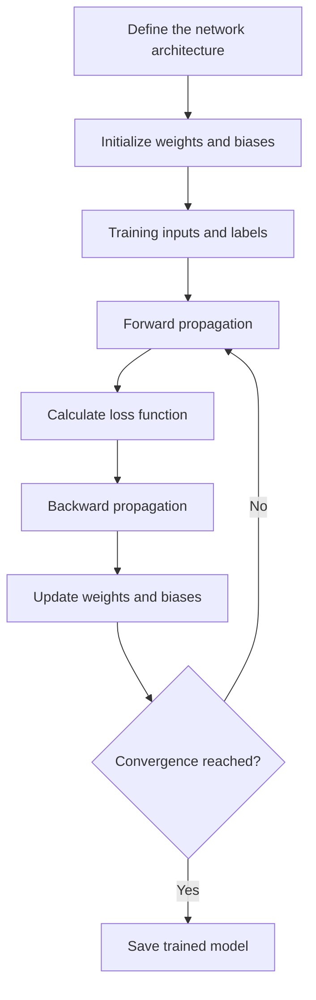

# FAA

  

---
# Features 💡

# Documentation 📝

Explore the documentation in the [docs/](/docs) directory.

# Workflow ⚙️

## References 🔗

### Julia
- [Julia Cheatsheet](https://cheatsheet.juliadocs.org/)
- [Julia Style Guide](https://docs.julialang.org/en/v1/manual/style-guide/)

### Git

#### Gitignore
- [GitHub Gitignore Repository](https://github.com/github/gitignore)
- [Video: Getting Started with Gitignore](https://www.youtube.com/watch?v=Ikf7hjMDmzw)

#### Conventional Commits
- [Conventional Commits Specification](https://www.conventionalcommits.org/es/v1.0.0/)
- [Video: Conventional Commits Introduction](https://www.youtube.com/watch?v=SigVVJmUGv8)
- [Video: Understanding Conventional Commits](https://www.youtube.com/watch?v=Cp_SHttVTi0)

#### Branching Strategy
- [Ship Show Ask: Branching Strategy](https://martinfowler.com/articles/ship-show-ask.html)
- [Video: Git Branching Strategy](https://www.youtube.com/watch?v=3FssKkNqUHE)

### VSCode
- [VSCode Settings Documentation](https://code.visualstudio.com/docs/getstarted/settings#_settingsjson)

# Contributors ✨

# Source Code Organization 📁
| Directory | Contents |
| ---- | ---- |
| `config/` | files for the enviroment configuration |
| `db/` | databases of train, test and validation |
| `docs/` | documentation files |
| `src/` | source code |

# External Libraries 👇
[Julia](https://github.com/JuliaLang/julia)

 

